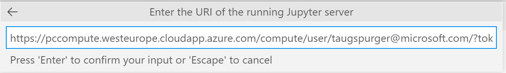
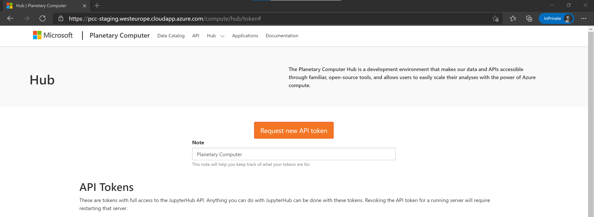
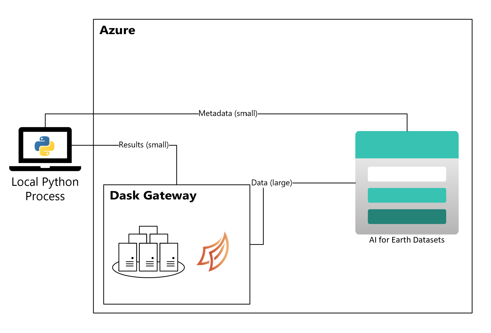
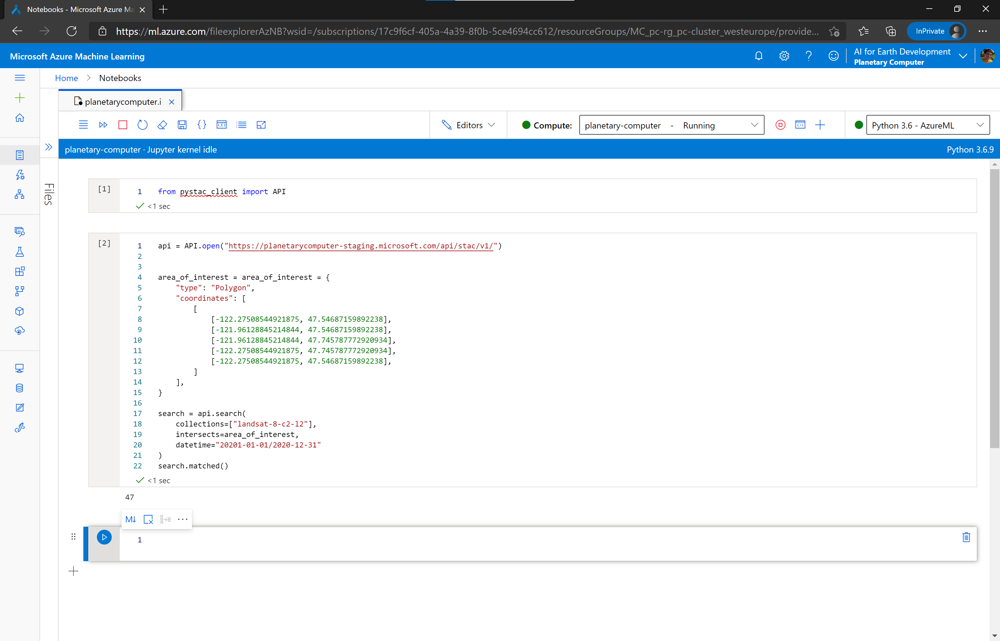

# Computing on the Planetary Computer

The core components of the Planetary Computer are the datasets and APIs for querying them. This document provides an overview of the various ways you can compute on data hosted by the Planetary Computer.

Regardless of how you compute on the data, to ensure maximum efficiency you should locate your compute as close to the data as possible.  The Planetary Computer Data Catalog is hosted in Azure's **West Europe** region, so your compute should be there too.

## Use our JupyterHub

The [Planetary Computer Hub](https://planetarycomputer-staging.microsoft.com/compute) is a [JupyterHub](https://jupyterhub.readthedocs.io/en/stable/) deployment in the West Europe Azure region. This is the easiest way to get started with computing on the Planetary Computer.  

```{note} You'll need to [request access](https://planetarycomputer.microsoft.com/account/request) to use the Planetary Computer Hub.
```

Once approved, you can log into the JupyterHub with your credentials. You'll get a computing environment that includes standard scientific and geospatial packages from one of the [Pangeo Docker Images](https://github.com/pangeo-data/pangeo-docker-images#pangeo-docker-images).

For scalable computation, the JupyterHub is also configured with [Dask Gateway](https://gateway.dask.org/). To create a Dask Cluster:

```python
>>> from dask_gateway import GatewayCluster

>>> cluster = GatewayCluster()  # Creates the Dask Scheduler. Might take a minute.
>>> client = cluster.get_client()
>>> cluster.adapt(minimum=1, maximum=100)
>>> cluster
GatewayCluster<prod.fbfed27704fc4d1da027dad20471993b, status=running>
```

With this setup, all of the computation happens on Azure, whether on a single node or on a cluster with Dask.


See [Scaling with Dask](../quickstarts/scale-with-dask.md) for an introduction to Dask. This setup was pioneered by the [Pangeo Community](https://pangeo.io/). The [Pangeo Cloud](https://pangeo.io/cloud.html) documention provides additional background on how to use Dask-enabled JupyterHubs.

## Use VS Code to connect to a remote Jupyter Kernel

[VS Code](https://code.visualstudio.com/) supports connecting to remote Jupyter Kernels. With this setup, you use a local instance of Visual Studio Code (installed on your laptop or Desktop computer) to connect to a remote Jupyter Kernel running in the Planetary Computer Hub.


You might choose this setup because you prefer VS Code as an editing environment and have configured your local instance to your taste. But you also value all the benefits of computing in the Planetary Computer Hub, things like having compute physically close to the data hosted by the Planetary Computer or not having to manage a Python environment.

This setup requires configuring your local VS Code installation.

1. **[Log into the Hub](https://pccompute.westeurope.cloudapp.azure.com/compute/hub/spawn)**.
   Currently you must start a notebook server by visiting the hub prior to connecting from VS Code.

2. **Install the [Jupyter Extension for Visual Studio Code](https://marketplace.visualstudio.com/items?itemName=ms-toolsai.jupyter)**.
   You can install the Jupyter Extension from [its website](https://marketplace.visualstudio.com/items?itemName=ms-toolsai.jupyter) or from within VS Code using the Extensions manager.

3. **Create a JupyterHub API Token**.
   Visit [http://planetarycomputer.microsoft.com/compute/hub/token](http://planetarycomputer.microsoft.com/compute/hub/token) to create an API token so that JupyterHub knows who you are when you try to connect from VSCode.

   ```{warning} This token is private and should not be shared publicly!
   ```

4. **Connect from VSCode**.

   Using the VS Code Command Pallet, select "Jupyter: Specify local or remote Jupyter server for connections".

   

   Then select **Existing** to specify the RUI of an existing server.

   

   Finally, input your connection string, which should look like `https://pccompute.westeurope.cloudapp.azure.com/compute/user/<YOUR_EMAIL>/?token=<YOUR_TOKEN>`

   

   The components in that URI are:

   - The Hub address: https://pccompute.westeurope.cloudapp.azure.com/compute
   - `/user/`
   - Your username: Probably your email address. Get this from the URL in your browser when you sign into the Hub.
   - `/?token=`
   - The token you just generated at [on the Hub](http://planetarycomputer.microsoft.com/compute/hub/token).

5. **Press "Enter" to connect to that kernel**.

   Then reload the Jupyter extension and you should be connected.

## Use our Dask Gateway

In this setup, you only use the Planetary Computer's scalable compute. You don't log into JupyterHub. Instead, your local machine drives the computation.
We recommend this approach for users who value, and are comfortable with, managing a local development environment. This setup requires a bit more care on your part: You need to ensure that the versions of libraries in your local environment are compatible with the versions running in Azure.

### Request a token from JupyterHub

Visit <https://planetarycomputer.microsoft.com/compute/hub/token> to generate a token. You'll be required to authenticate to generate a token.



Substitute that token anywhere you see `<JUPYTERHUB_TOKEN>` below.

### Connect to the Gateway

Similar to before, we'll use `dask_gateway` to connect. Only now we need to provide the URLs explicitly.

```python
>>> from dask_gateway import Gateway, auth

>>> jupyterhub_auth = auth.JupyterHubAuth(api_token="<JUPYTERHUB_TOKEN>")  # from step 1
>>> gateway = Gateway(
...     "https://pccompute.westeurope.cloudapp.azure.com/compute/services/dask-gateway/",
...     proxy_address="gateway://pccompute-dask.westeurope.cloudapp.azure.com",
...     auth=jupyterhub_auth,
... )
>>> gateway.list_clusters()
[]
```

Now that you're connected, create a cluster as usual.

```python
>>> cluster = gateway.new_cluster()  # Creates the Dask Scheduler. Might take a minute.
>>> client = cluster.get_client()
>>> cluster.adapt(minimum=1, maximum=100)
```

From here on, computations using Dask will take place on the cluster. When you `.compute()` a result and bring it back locally,
it will come to the Python process running on your local machine. Ideally the results returned locally are small enough that the
lower bandwidth between Azure and your local machine aren't a bottleneck.



## Use your own compute

The previous two methods relied on compute provided by the Planetary Computer. If you have your own Azure resources you can use those to access the Planetary Computer's Datasets.  
That said, make sure your resources are in the **West Europe** Azure Region.  Putting your compute in the same region as the data is the most efficient way to do your computation.

### Using Azure Machine Learning

If you have an existing [Azure Machine Learning](https://docs.microsoft.com/en-us/azure/machine-learning/) workspace, you can use it to access data and APIs hosted by the Planetary Computer.
Here we show accessing the Planetary Computer's Metadata API from Azure Machine Learning Studio.



Under this scenario, we're using Azure Machine Learning Studio to connect to a virtual machine running in Azure. That virtual machine has a high-bandwidth connection to the Planetary Computer Data and Metadata APIs.


### Using Dask Cloud Provider

Users with requiring specialized software environments or a lot of compute can use their own resources to access the Planetary Computer's Data and Metadata APIs.

In this example, we use `Dask Cloud Provider` to create a Dask cluster with just an Azure subscription. After following the setup instructions at <https://cloudprovider.dask.org/en/latest/azure.html>, you can create your cluster:

```python
>>> from dask_cloudprovider.azure import AzureVMCluster
>>> cluster = AzureVMCluster(resource_group="<resource group>",
...                          vnet="<vnet>",
...                          security_group="<security group>",
...                          n_workers=1)
Creating scheduler instance
Assigned public IP
Network interface ready
Creating VM
Created VM dask-5648cc8b-scheduler
Waiting for scheduler to run
Scheduler is running
Creating worker instance
Network interface ready
Creating VM
Created VM dask-5648cc8b-worker-e1ebfc0e
```

and connect to it

```python
>>> from dask.distributed import Client
>>> client = Client(cluster)
```

Like the previous setup, the Dask scheduler and workers are running in Azure near the data. The local client might be outside of Azure.


