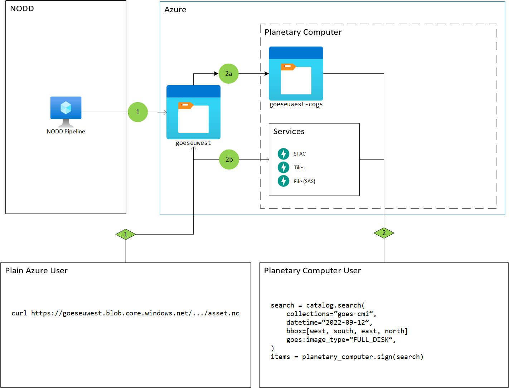

## Data Catalog

The Planetary Computer provides key geospatial and conservation datasets,
free of charge and powered by the Azure cloud. Visit the [Data
Catalog](https://planetarycomputer.microsoft.com/catalog) to discover what
data is currently available and to review important metadata about their
content, including what specific assets are included. Each dataset also
includes runnable example code showing how to access and use the data with
other Planetary Computer components.

Read more about how the Planetary Computer uses open-source tools to make
[finding](../quickstarts/reading-stac.ipynb) and [using](./computing.md) our
data easy and approachable.

### Data Providers

The Planetary Computer could not exist without the upstream data providers who
actually generate the data. In some cases, these upstream providers also ensure
that the data is available on Azure.

This diagram shows the relationship between the
[NOAA Open Data Dissemination](https://www.noaa.gov/information-technology/open-data-dissemination)
(NODD) program and the Planetary Computer.

This diagram starts with NODD pushing data assets to Azure, represented by the
green circle 1. In many cases, these assets are available seconds or minutes
after the asset is generated (e.g. a
[GOES-CMI](https://planetarycomputer.microsoft.com/dataset/goes-cmi) image is
captured by a GOES satellite). At this point, the raw data are immediately
available to anyone through the highly scalable [Azure Blob
Storage](https://learn.microsoft.com/en-us/azure/storage/blobs/storage-blobs-overview).
Users can access the data using whatever tool they want that can make HTTP
requests to the Blob Storage endpoint. In the diagram, this is represented by
the green diamond 1, showing a "plain" Azure user accessing an individual file
using `curl`.

For some use cases, just having access to the raw data is sufficient. But to satisfy even more use
cases, the Planetary Computer provides some additional services and assets on top of the raw data.

First, the Planetary Computer might produce cloud-optimized versions of the same data;
for example converting HDF5 files to [Cloud Optimized GeoTIFF](https://www.cogeo.org/).
In the diagram this is represented by the green circle 2a, which shows the Planetary Computer
generating COGs and storing them in the `goeseuwest-cogs` storage container.

Second, the Planetary Computer provides additional services to make working
with geospatial data much easier (depicted by the green circle 2b in the diagram).

To work with the raw data pushed to Azure, users need to somehow know the naming
convention of each data product, and parse it to find the data they want (green
diamond 1). With the Planetary Computer's [STAC API](../quickstarts/reading-stac.ipynb), users can search for the data using
high-level concepts like date ranges, bounding boxes, and more (green diamond
2). In addition to the STAC API, the Planetary Computer provides a tile server
for quickly visualizing the data on a map, which is used by our
[Explorer](../overview/explorer.md)

Finally, note that the STAC API *also* catalogs the raw data from the upstream
data providers. So it's not an "either-or": users of the Planetary Computer can
also use the raw data from the upstream data provider.

### Access patterns

Most of our datasets are 
indexed and searchable using the open [STAC specification](https://stacspec.org/).
These search and access API endpoints lower the barrier to finding specific
data you need over large spatial and temporal extents. The data itself is
still stored on Azure Blob Storage and can be used with existing, familiar
tools.

While not yet available to be searched by our STAC API, the Planetary
Computer also hosts and documents dozens of additional datasets important to
environmental sustainability and Earth science. These datasets can be used
alongside the STAC indexed data, or any other data you have. We'll be
incorporating these important datasets into the STAC API over the coming
months.

While freely accessible, we do require tokens to access some data sets. Read
more about [using tokens for data access](sas.md).

### Future plans

We are working with partners to develop and
onboard new datasets into the Planetary Computer, and to make them discoverable
and accessible through open APIs. We're also developing features that will
allow users to perform analysis and generate visualizations directly from the
Data Catalog.

If you have feedback about our existing datasets, or are interested in seeing
additional datasets, contact us at <a href="mailto:planetarycomputer@microsoft.com">planetarycomputer@microsoft.com</a>.
