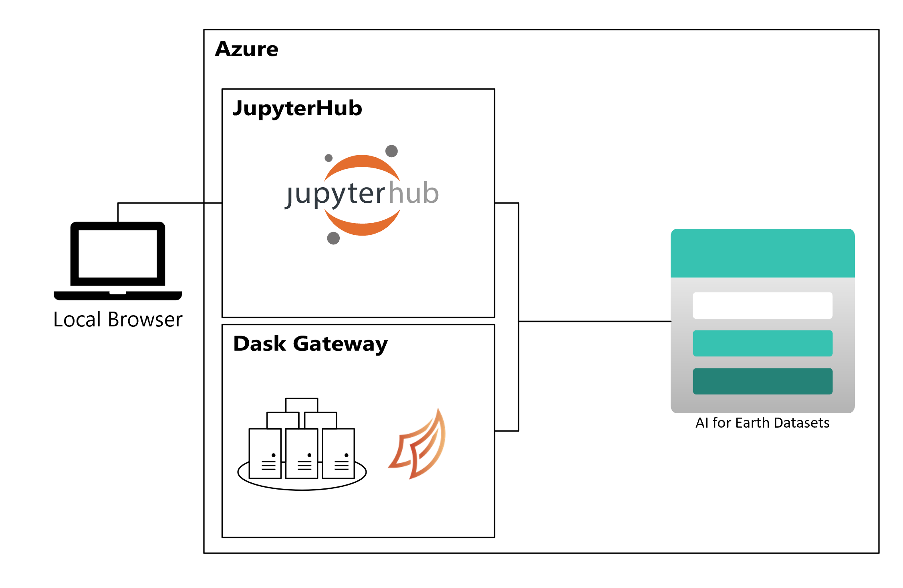
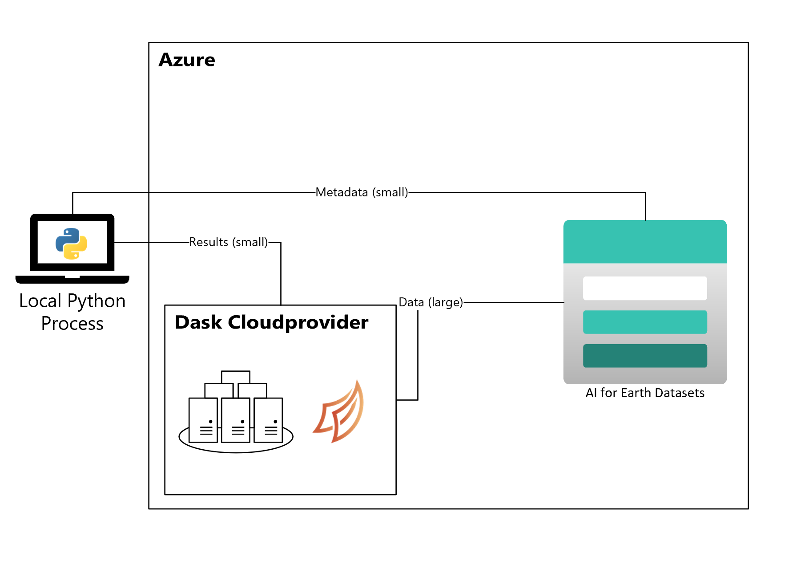

# Using Hub resources

The core of the Planetary Computer are the datasets and APIs for querying them. This document gives an overview of the various ways you can compute on data hosted by the Planetary Computer.

Regardless of how you compute on the data, to ensure maximum efficiency you should locate your compute as close to the data as possible.
All the data is hosted in Azure's **West Europe** region so your compute should be there too.

## Use our JupyterHub

The AI for Earth team maintains a [JupyterHub](https://jupyterhub.readthedocs.io/en/stable/) deployment in the **West Europe** region. This is the easiest way to get started. We recommend this approch for users with small to moderate compute needs.

Once approved, you can log into the JupyterHub with your credentials. You'll get a computing environment that includes standard scientific and geospatial packages from one of the [Pangeo Docker Images](https://github.com/pangeo-data/pangeo-docker-images#pangeo-docker-images).

For scalable computation, the JupyterHub is also configured with [Dask Gateway](https://gateway.dask.org/). To create a Dask Cluster:

```python
>>> from dask_gateway import GatewayCluster

>>> cluster = GatewayCluster()  # Creates the Dask Scheduler. Might take a minute.
>>> client = cluster.get_client()
>>> cluster.adapt(minimum=1, maximum=100)
>>> cluster
GatewayCluster<prod.fbfed27704fc4d1da027dad20471993b, status=running>
```

With this setup, all of the computation happens on Azure, whether on a single node or on a cluster with Dask.



See [...] for more. The [Pangeo Cloud](https://pangeo.io/cloud.html) documention provides background on this type of setup.

## Use our Dask Gateway

In this setup, you only use the Planetary Computer's scalable compute. You don't log into JupyterHub. Instead, your local machine drives the computation.
We recommend this approach for users who value, and are comfortable with, managing a local development environment. This setup requires a bit more care on your part: You need to ensure that the versions of libraries in your local environment are compatible.

1. Request a token from JupyterHub

Visit <https://planetarycomputer-staging.microsoft.com/compute/hub/token> to generate a token. You'll be required to authenticate to generate a token.

[image]

Substitute that token anywhere you see `<JUPYTERHUB_TOKEN>` below.

2. Connect to the Gateway

Similar to before, we'll use

```python
>>> from dask_gateway import Gateway, auth

>>> jupyterhub_auth = auth.JupyterHubAuth(api_token="<JUPYTERHUB_TOKEN>")  # from step 1
>>> gateway = Gateway(
...     "https://pcc-staging.westeurope.cloudapp.azure.com/compute/services/dask-gateway/",
...     proxy_address="gateway://pcc-dask-staging.westeurope.cloudapp.azure.com",
...     auth=jupyterhub_auth,
... )
>>> gateway.list_clusters()
[]
```

Now that you're connected, create a cluster as usual.

```python
>>> cluster = gateway.new_cluster()  # Creates the Dask Scheduler. Might take a minute.
>>> client = cluster.get_client()
>>> cluster.adapt(minimum=1, maximum=100)
```

From here on, computations using Dask will take place on the cluster. When you `.compute()` a result and bring it back locally,
it will come to the Python process running on your local machine.


## Use your own Compute

The previous two methods relied on compute provided by the AI for Earth Team. If you have your own Azure reasources you can use those to access the Planetary Computer's Datasets.
**Make sure your resources are in the West Europe Azure Region.**

We recommend this approach for users with high computation needs or require specialized software environments.

In this example, we use `Dask Cloudprovider` to create a Dask Cluster with just an Azure subscription. After following the setup instructions at <https://cloudprovider.dask.org/en/latest/azure.html>, you can create your cluster:

```python
>>> from dask_cloudprovider.azure import AzureVMCluster
>>> cluster = AzureVMCluster(resource_group="<resource group>",
...                          vnet="<vnet>",
...                          security_group="<security group>",
...                          n_workers=1)
Creating scheduler instance
Assigned public IP
Network interface ready
Creating VM
Created VM dask-5648cc8b-scheduler
Waiting for scheduler to run
Scheduler is running
Creating worker instance
Network interface ready
Creating VM
Created VM dask-5648cc8b-worker-e1ebfc0e
```

and connect to it

```python
>>> from dask.distributed import Client
>>> client = Client(cluster)
```

Like the previous setup, the Dask scheduler and workers are running in Azure near the data. The local client might be outside of Azure.


