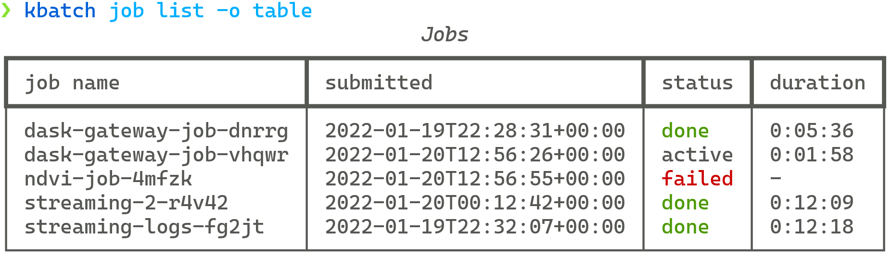

# Running batch jobs

The [Planetary Computer Hub][hub] is a great option for *interactive* data analysis. But JupyterHub isn't primarily designed for
asynchronous (or batch) workflows, where you submit some kind of job and let it run to completion.

The Hub includes a [kbatch](https://kbatch.readthedocs.io/en/latest/) service, which lets you submit jobs to run on the same
computing infrastructure as your interactive workflows. See the [installation instructions](https://kbatch.readthedocs.io/en/latest/#install)
for kbatch to get started.

## Configuration

Once you have `kbatch` installed, you can configure the Hub URL and token to use.

First, visit the [token generation page][token] to generate a token


Next, use `kbatch configure`

```{code-block} console
$ kbatch configure --kbatch-url=https://pccompute.westeurope.cloudapp.azure.com/compute/services/kbatch --token='<your-jupyterhub-token>'
```

## Submit a Job

Use `kbatch submit` to submit a "job", which is just some commands to run. At a minimum, your job needs to include

1. A name to identify your job
2. A container image, which defines the software environment the job will run in
3. A command to run

```{code-block} console
❯ kbatch job submit ...
```

List your jobs with `kbatch job list`:



See the [kbatch examples gallery][gallery] for more.

## Job runtime

These batch jobs run in the same compute environment as the JuptyerHub. In particular, they include access to Dask Gateway, so you're able to start
and stop Dask clusters just as if you were running on the hub.

```{note}
Your jobs will *not* have access to your JupyterHub home directory. You'll need to submit any [code files][code] along with your job.
```

## Limitations

`kbatch` jobs are simply commands to be executed. It doesn't offer any fancier workflow orchestration features like alerting, automatically parallelization, artifact management, etc.

[hub]: environment.md
[token]: https://pccompute.westeurope.cloudapp.azure.com/compute/hub/token
[gallery]: https://kbatch.readthedocs.io/en/latest/examples/index.html
[code]: https://kbatch.readthedocs.io/en/latest/user-guide.html#submitting-code-files