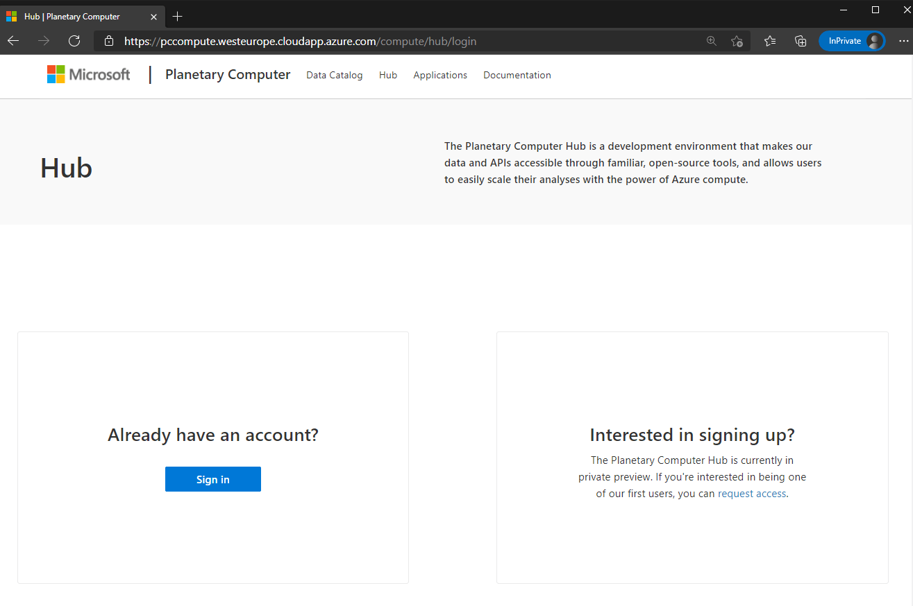
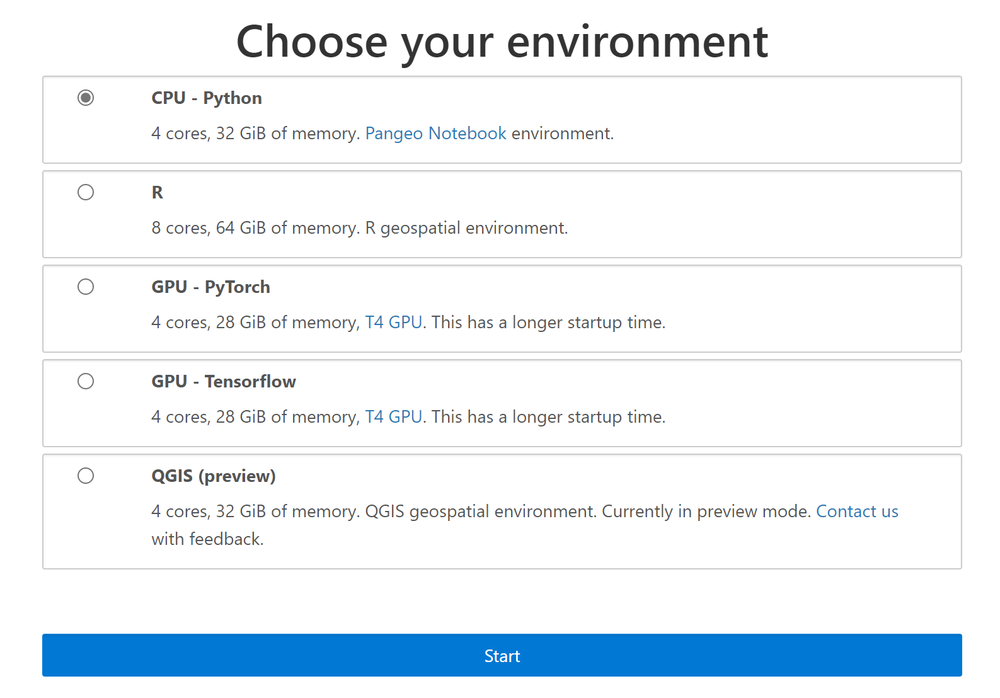
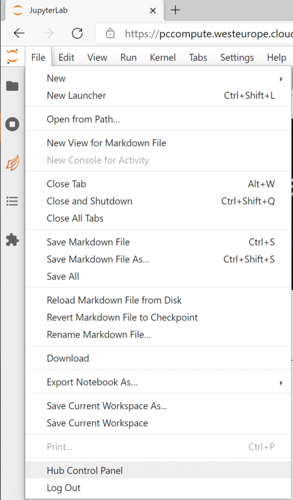
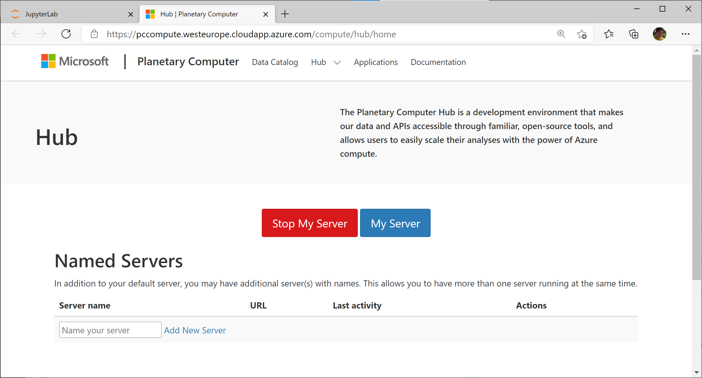

# Planetary Computer Hub

The Planetary Computer Hub is a convenient option for computing on the [data](https://planetarycomputer.microsoft.com/catalog) provided by the Planetary Computer. The Hub is a [JupyterHub](https://jupyterhub.readthedocs.io/en/stable/) deployment that includes a set of commonly used packages for geospatial and sustainability data analysis. It's enabled with [Dask](https://dask.org/) for scalable computing.

## Logging in

Once you have an [account](https://planetarycomputer.microsoft.com/account/request) on the Planetary Computer, you can log into the Hub. Visit [http://planetarycomputer.microsoft.com/compute](http://planetarycomputer.microsoft.com/compute) to access the Hub.



The Hub offers several *environments* to customize your computing environment. This determines the computing power (CPU cores, memory, GPUs) and software environment of your server.



Select an environment and click *Start* to start your server. You'll see a progress bar and some logs as your server comes online. Once it's ready you'll be redirected to Jupyterlab.

## Stopping your server

When you're done with your session on the hub, make sure to stop your server to release the resources your consuming. From the Jupyterlab UI, select *File > Hub Control Panel*. This will open a new tab at [https://pccompute.westeurope.cloudapp.azure.com/compute/hub/home](https://pccompute.westeurope.cloudapp.azure.com/compute/hub/home), which lets you manage your servers.



Select *Stop My Server* to stop your server and release all of the resources you're consuming.



Note that we will automatically stop servers that seem to be idle.

## Using JupyterLab

The [JupyterLab User Guide](https://jupyterlab.readthedocs.io/en/stable/user/interface.html) describes the JupyterLab User Interface in detail. The Hub environments include a few common extensions.

* Dask Labextension: Dask diagnostics from within jupyterlab. See [Scale with Dask](quickstarts/scale-with-dask/) for more (Python only).
* GeoJSON rending with [jupyterlab-geojson](https://github.com/jupyterlab/jupyter-renderers/tree/master/packages/geojson-extension).

## Understanding the file-system

Your server has a **home directory** at `/home/jovyan/` where you can store local files. This directory persists across sessions; if you create a file in `/home/jovyan/`, stop your server, and start it up again that file will still be there.

Everything *outside* of `/home/jovyan` is *not* persisted across sessions. For example, if you make a modification to the Python environment at `/srv/conda/envs/notebook` by manually `pip install`ing a package, that new package will not be available after stopping and starting your server.

You should only store code, notebooks, and analysis documents in your home directory.
Notably, you shouldn't store large amounts of data in your home directory. Instead, use something like [Azure Blob Storage](https://docs.microsoft.com/en-us/azure/storage/blobs/storage-blobs-introduction) instead (make sure to use the West Europe region, which is where your server is running).

## Environment Variables

We set several environment variables when your server is started.

Variable                           | Value         | Description
---------------------------------- | ------------- | -----------
PC_SDK_SUBSCRIPTION_KEY            | unique to you | Used to [sign assets](../concepts/sas) to download data.
GDAL_DISABLE_READDIR_ON_OPEN       | EMPTY_DIR     | [Improves GDAL performance](https://trac.osgeo.org/gdal/wiki/ConfigOptions#GDAL_DISABLE_READDIR_ON_OPEN) when opening single COGs with GDAL.
GDAL_HTTP_MERGE_CONSECUTIVE_RANGES | YES           | [Improves GDAL performance](https://trac.osgeo.org/gdal/wiki/ConfigOptions#GDAL_HTTP_MERGE_CONSECUTIVE_RANGES) by merging consecutive HTTP requests.

## Understanding the software environment

Your software environment is determined by the environment you selected when starting your server. It's a [conda environment](https://docs.conda.io/projects/conda/en/latest/user-guide/tasks/manage-environments.html) located at ``/srv/conda/envs/notebook``. The environment contains many software libraries that are helpful for geospatial data analysis The environments are defined and packaged into Docker containers in the [planetary-computer-containers][containers] repository.

As mentioned [above](#Understanding-the-file-system), changes to the environment outside of your home directory are not persisted across sessions. If you ``pip`` or ``conda`` install a package, it will not be present the next time you start your server.

If you're using Dask for scalable computing, you should ensure that modifications you make to your local software environment are present on the workers too. Dask provides a [PipInstallPlugin](https://distributed.dask.org/en/latest/plugins.html#distributed.diagnostics.plugin.PipInstall) to automatically install packages when workers start

```python
>>> from dask.distributed import PipInstall
>>> plugin = PipInstall(packages=["scikit-learn"], pip_options=["--upgrade"])
>>> client.register_worker_plugin(plugin)
```

Note that this will slow down worker startup, since the packages will need to be found and downloaded before the worker can start executing tasks.

## Cluster Limits

There are a few restrictions on the size of the Dask Clusters you can create.

1. The maximum number of **cores per worker** is 8, and the maximum amount of **memory per worker** is 64 GiB. This ensures that the workers fit in the [Standard_E8_v3 Virtual Machines][vms] used for workers.
2. The maximum number of **cores per cluster** is 400
3. The maximum amount of **memory per cluster** is 3200 GiB
4. The maximum number of **workers per cluster** is 400

With the default settings of 1 core and 8 GiB per worker, this means a limit of 400 workers on 50 physical nodes (each with 8 cores and 64 GiB of memory). If this limit is too low for your use-case, [send us an email][email].

If you attempt to scale beyond the maximum cores or memory per worker, an exception is raised since your requested workers are larger than they Virtual Machines can handle.

```python
>>> gateway = dask_gateway.Gateway()
>>> options = gateway.cluster_options()
>>> options["worker_cores"] = 16
Traceback (most recent call last):
...
ValueError: worker_cores must be <= 8.000000, got 16.0
```

If you attempt to scale beyond the maximum number of cores, memory, or workers per cluster, you'll see a warning and the cluster will be scaled to the limit.

```python
>>> cluster = gateway.new_cluster()
>>> cluster.scale(1_000)
GatewayWarning: Scale request of 1000 workers would exceed resource limit of 400 workers. Scaling to 400 instead.
```

[vms]: https://docs.microsoft.com/en-us/azure/virtual-machines/ev3-esv3-series
[email]: mailto:planetarycomputer@microsoft.com
[containers]: https://github.com/microsoft/planetary-computer-containers