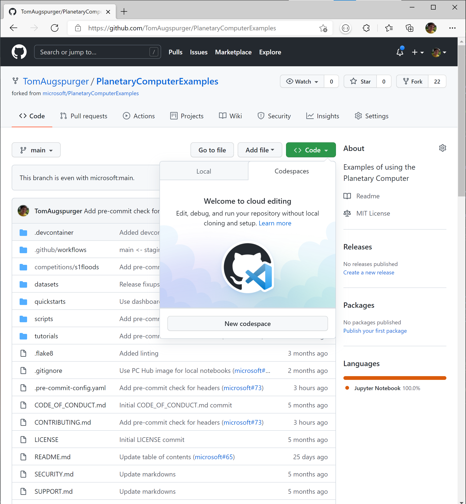
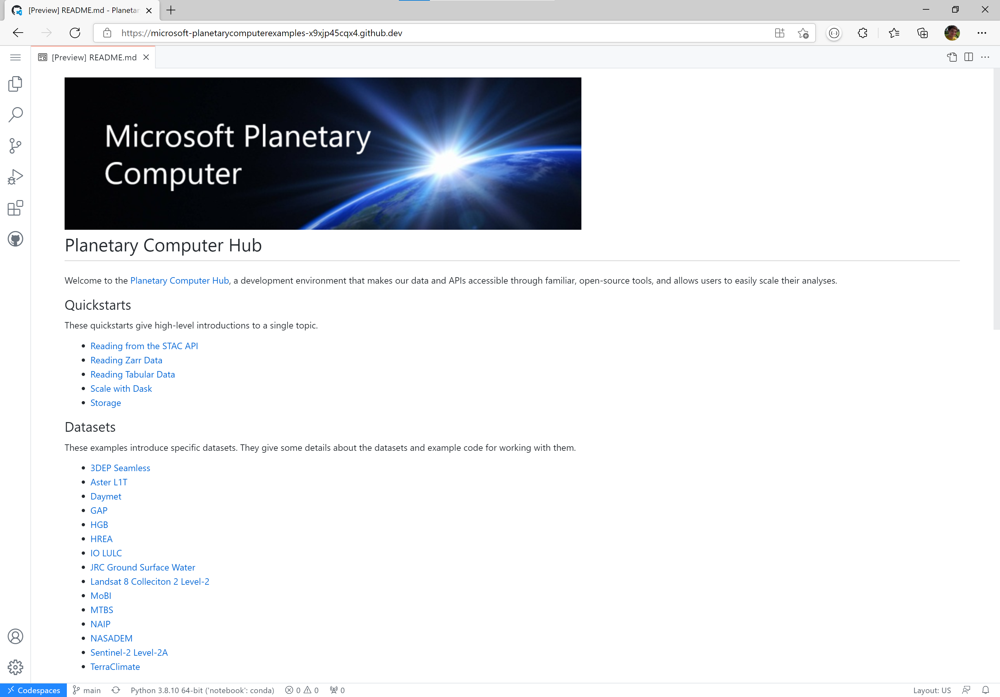
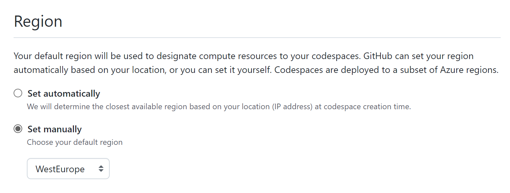
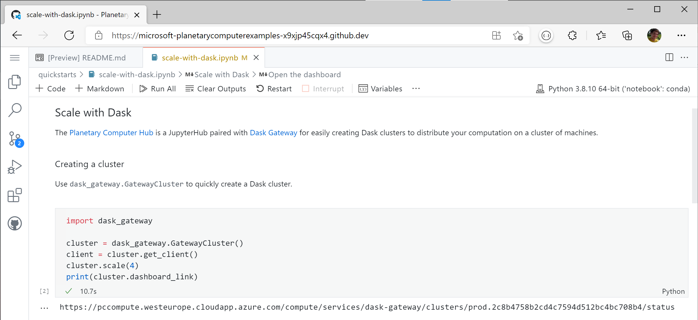

# Use GitHub Codespaces

[GitHub Codespaces][codespaces] is a development environment that's hosted in the cloud.

The easiest way to get started is to [fork] the [Planetary Computer Examples][examples] repository and create a new Codespace (we recommend [setting a default region](#setting-a-default-region) first).



This will create a Codespace under your GitHub account that's configured to work well with our data.



## Set a default region

We recommend that you create your Codespaces in the West Europe. You can do this per-Codespace, or set a [default region][region].



This ensures that your compute node is in the same Azure region as the data, giving the highest performance when accessing data from the [Planetary Computer catalog][catalog].

## Use Planetary Computer environments

Your Codespace uses a [dev container][container] to provide all the software and tools needed to do your data analysis and software development.

We publish our environments, which contain many packages useful for geospatial data analysis, at <https://github.com/microsoft/planetary-computer-containers>. These can be used in the Codespaces [configuration] for your project to ensure you have access to those packages.

## Use the Planetary Computer's Dask Gateway

Codespaces gives you access to a single node that's physically close to the Planetary Computer's data. If you need multiple machines, you can the Planetary Computer's Dask Gateway to scale your analysis.

```{note} Using the Planetary Computer's Dask Gateway requires a Planetary Computer account. If you don't have an account, you can [request access][request].
```

First, you'll need a JupyterHub API token. You can generate one at <https://planetarycomputer.microsoft.com/compute/hub/token>.

Next, set that JupyterHub API token as an encrypted secret by following [this guide](https://docs.github.com/en/codespaces/managing-your-codespaces/managing-encrypted-secrets-for-your-codespaces). You'll need to grant access to the repositories you want to access the secret. To ensure that it's detected automatically by dask-gateway, the environment variable must be named `JUPYTERHUB_API_TOKEN`.

Finally, configure your `devcontainer.json` file to include the relevant environment variables. If you created your Codespace by forking [Planetary Computer Examples][examples], you'll already have these set.

```json
{
    "containerEnv": {
        "DASK_GATEWAY__AUTH__TYPE": "jupyterhub",
        "DASK_GATEWAY__CLUSTER__OPTIONS__IMAGE": "pcccr.azurecr.io/public/planetary-computer/python:latest",
        "DASK_GATEWAY__ADDRESS": "https://pccompute.westeurope.cloudapp.azure.com/compute/services/dask-gateway",
        "DASK_GATEWAY__PROXY_ADDRESS": "gateway://pccompute-dask.westeurope.cloudapp.azure.com:80",
    }
}
```

Now, you can create a [Dask] cluster and distribute your workload on multiple machines.



Any computations using Dask will execute on your cluster.

[catalog]: https://planetarycomputer.microsoft.com/catalog
[codespaces]: https://github.com/features/codespaces
[configuration]: https://docs.github.com/en/codespaces/customizing-your-codespace/configuring-codespaces-for-your-project
[container]: https://docs.github.com/en/codespaces/customizing-your-codespace/configuring-codespaces-for-your-project#about-dev-containers
[examples]: https://github.com/microsoft/planetarycomputerexamples
[fork]: https://guides.github.com/activities/forking/
[region]: https://docs.github.com/en/codespaces/managing-your-codespaces/setting-your-default-region-for-codespaces
[request]: https://planetarycomputer.microsoft.com/account/request
[Dask]: https://dask.org/