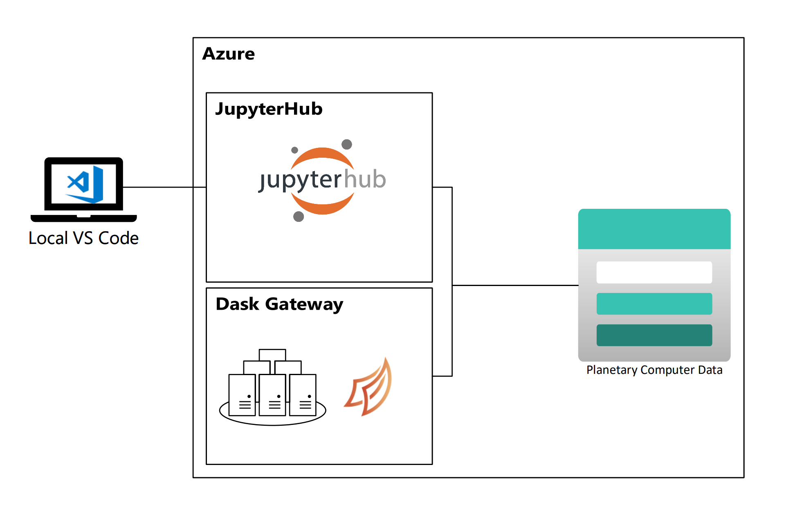
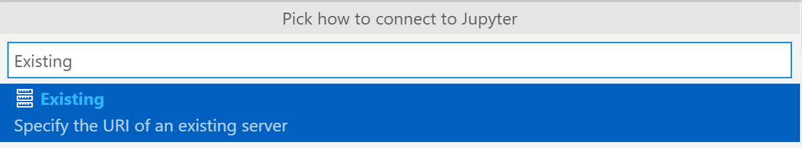
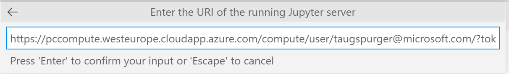

# Use Visual Studio Code

You can connect to the Planetary Computer Hub using [Visual Studio Code](https://code.visualstudio.com/). With this setup, you use a local instance of VS Code (installed on your laptop or desktop computer) to connect to a remote Jupyter kernel running in the Planetary Computer Hub.

You might choose this setup - rather than logging in to the Hub directly and working in JupyterLab - because you prefer VS Code as an editing environment and have customized your local environment, but you still want the benefits of computing in the Planetary Computer Hub, like having compute that's physically close to Planetary Computer data and not having to manage a Python environment.

The *source files* you're working with will be stored on your local machine's hard drive, but they will be executed in Azure, next to the data. 

## Setting up your Hub environment 

Before you can work with the Planetary Computer Hub with VS Code, you need to start a server on the Hub and create your API token.

1. **[Log into the Hub](https://pccompute.westeurope.cloudapp.azure.com/compute/hub/spawn)** to start a notebook server prior to connecting from VS Code.

2. **[Create a JupyterHub API Token](http://planetarycomputer.microsoft.com/compute/hub/token)** so that JupyterHub knows who you are when you try to connect from VS Code. This token is private and should not be shared publicly!

## Setting up your local environment 

2. **Install the Jupyter Extension for VS Code** from [the online VS extension marketplace](https://marketplace.visualstudio.com/items?itemName=ms-toolsai.jupyter) or from within VS Code using the [embedded extension marketplace](https://code.visualstudio.com/docs/editor/extension-marketplace).

3. **Optionally clone the [Planetary Computer Examples](https://github.com/Microsoft/PlanetaryComputerExamples) repository** to your local environment.  This step is not required, but this repo provides a number of useful starter examples.

4. **Connect from VSCode**.

   Using the VS Code Command Palette, select "Jupyter: Specify local or remote Jupyter server for connections":

   

   Then select "Existing" to specify the URI of an existing server:

   

   Finally, input your connection string, which should look like `https://pccompute.westeurope.cloudapp.azure.com/compute/user/<YOUR_EMAIL>/?token=<YOUR_TOKEN>`:

   

   The components in that URI are:

   - The Hub address: `https://pccompute.westeurope.cloudapp.azure.com/compute`
   - `/user/`
   - Your username: Probably your email address. Get this from the URL in your browser when you sign into the Hub.
   - `/?token=`
   - The token you just generated [on the Hub](http://planetarycomputer.microsoft.com/compute/hub/token).

5. **Press "Enter" to connect to that kernel**.

   Then reload the Jupyter extension and you should be connected.

VS Code will save this configuration. The next time you connnect you just need to start your server and select that existing connection string.

